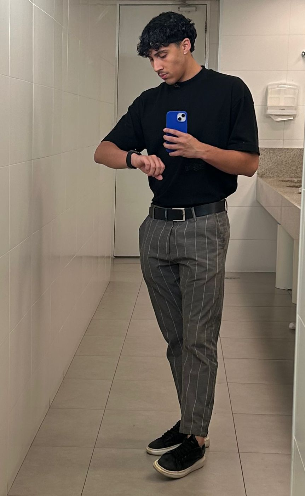
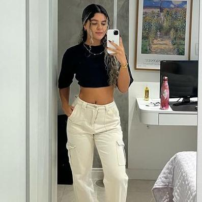

# DarkFit 🏋️‍♂️

### OBJETIVO

Este repositório tem como objetivo centralizar e organizar o projeto da academia DarkFit, apresentando o site institucional com informações sobre treinos, agendamentos e estrutura da academia, utilizando HTML, CSS e Bootstrap.

### SOBRE O PROJETO

O projeto consiste em um site responsivo da DarkFit, com destaque para imagens de alta qualidade, carrossel de fotos da academia, cards informativos sobre unidades e personal trainers, e navegação intuitiva. O objetivo é fornecer uma experiência agradável ao usuário e apresentar os principais serviços e diferenciais da academia.

O site foi desenvolvido utilizando **HTML5 semântico**, **CSS personalizado** e **Bootstrap** para garantir responsividade e estilo moderno.

### DOWNLOAD DO PROJETO

Baixe o projeto em seu computador através do comando:

```bash
git clone https://github.com/luanadias00/DarkFit.git
```

**ou**

1. Clique em `<> Code`.
2. Faça o download do arquivo ZIP.
3. Extraia o arquivo em uma pasta de sua preferência.

### ESTRUTURA DO PROJETO

```text
DarkFit/
├── image/                  
├── css/
│   ├── style.css           
│   └── bootstrap.min.css   
├── js/
│   └── bootstrap.bundle.min.js
├── index.html
└── .gitignore
```

### ACESSO PELO NAVEGADOR

1. Abra a pasta do projeto.
2. Clique duas vezes no arquivo `index.html`.
3. O site será aberto no seu navegador padrão.

### TECNOLOGIAS


### FERRAMENTAS

&nbsp;
&nbsp;


### EQUIPE

<table align="center">
  <tr>
    <td align="center">
      <a href="https://github.com/HenryModesto" title="Github Henry">
        <br>
        <sub>
          <b>HENRY MODESTO</b><br>
          <b>2401244</b>
        </sub>
      </a>
    </td>
    <td align="center">
      <a href="https://github.com/GabryelVenancio" title="Github Gabryel Venancio">
        <br>
        <sub>
          <b>GABRYEL VENANCIO</b><br>
          <b>2302495</b>
        </sub>
      </a>
    </td>
    <td align="center">
      <a href="https://github.com/AndreyT1224" title="Github Andrey">
        <br>
        <sub>
          <b>ANDREY TOMAZ</b><br>
          <b>2400729</b>
        </sub>
      </a>
    </td>
    <td align="center">
      <a href="https://github.com/luanadias00" title="Github Luana Dias">
         
    <br>
        <sub>
          <b>LUANA DIAS</b><br>
          <b>2401121</b>
        </sub>
      </a>
    </td>
     <td align="center">
      <a href="https://github.com/JanainaFi" title="Github Janaina">
        <br>
        <sub>
          <b>JANAINA SILVA</b><br>
          <b>2400683</b>
        </sub>
      </a>
    </td>
    <td align="center">
      <a href="https://github.com/mauricio003" title="Github Mauricio">
        <br>
        <sub>
          <b>MAURICIO COSTA</b><br>
          <b>2400487</b>
        </sub>
      </a>
    </td>
    
  </tr>
</table>
